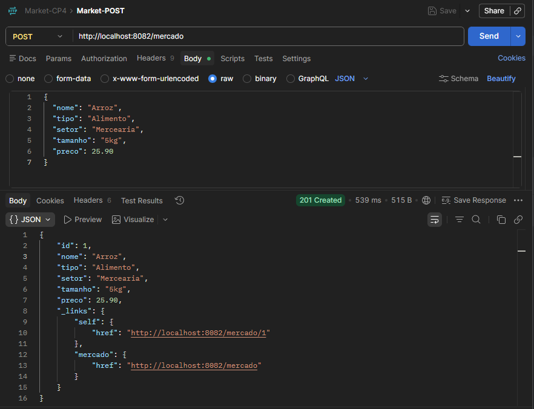
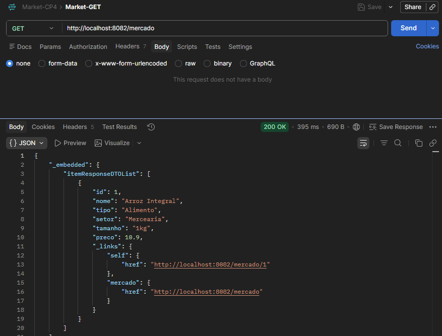
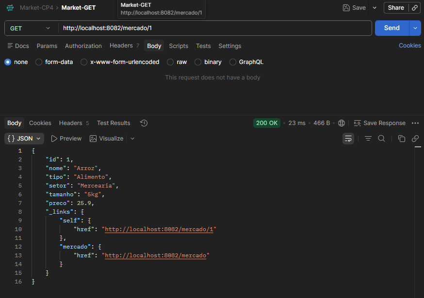
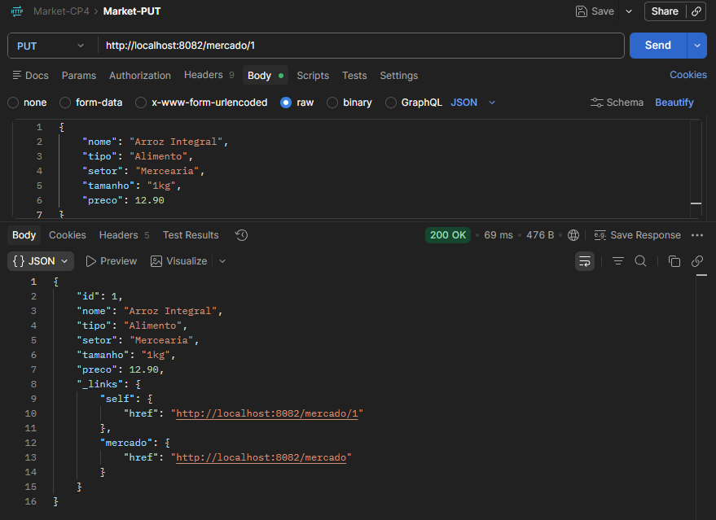
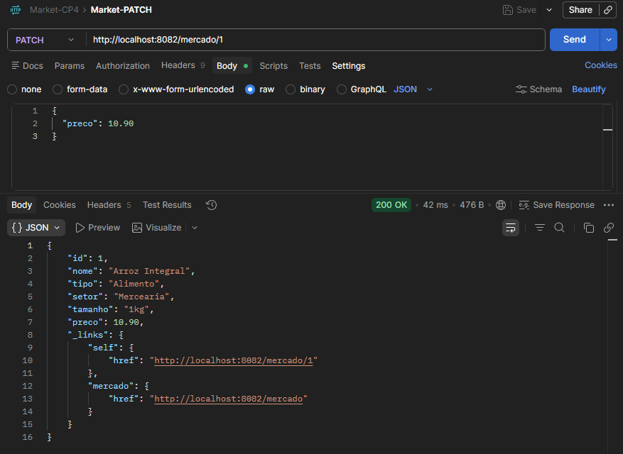
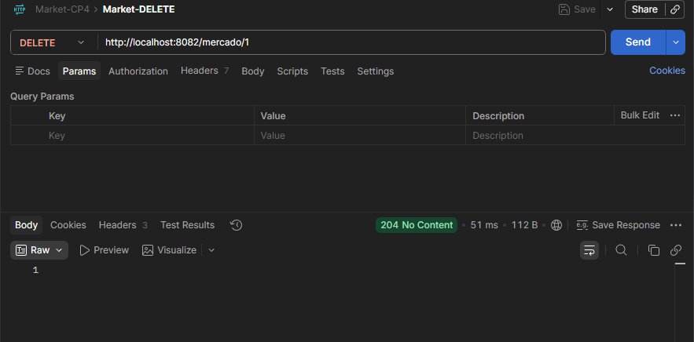
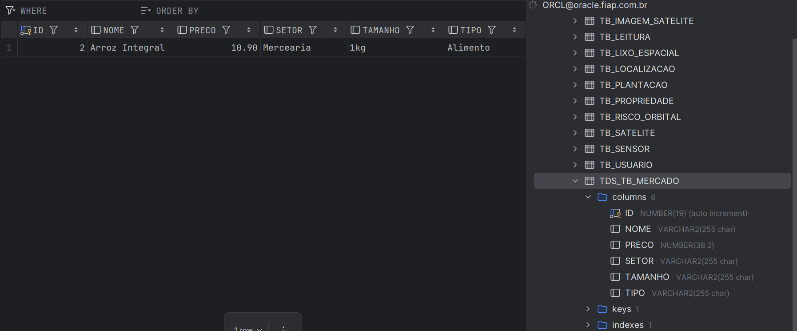

# Market Express API

API REST desenvolvida como parte do Checkpoint 4 - Parte I, do curso de Tecnologia em Análise e Desenvolvimento de Sistemas da FIAP.

O projeto consiste em uma aplicação para gerenciamento de produtos de um Mercado Express, utilizando Spring Boot, persistência com Oracle Database, Lombok, arquitetura em camadas e HATEOAS.

A aplicação possui operações completas de CRUD utilizando os métodos HTTP POST, GET, PUT, PATCH e DELETE.

---

## Informações Acadêmicas

- Instituição: FIAP - Faculdade de Informática e Administração Paulista
- Curso: Tecnologia em Análise e Desenvolvimento de Sistemas
- Checkpoint: CP4
- Parte: Parte I - API e Deploy
- Professor: Dr. Marcel Stefan Wagner
- IDE utilizada: IntelliJ IDEA

---

## Sobre o Projeto

A Market Express API permite cadastrar e gerenciar produtos de um mercado através de uma API REST.

Cada item possui as seguintes informações:

- ID
- Nome
- Tipo
- Setor
- Tamanho
- Preço

A aplicação permite:

- Cadastrar um novo item
- Listar todos os itens
- Buscar um item pelo ID
- Atualizar completamente um item
- Atualizar parcialmente um item
- Excluir um item pelo ID

Além das operações de CRUD, foi implementado HATEOAS, permitindo que as respostas da API possuam links relacionados aos recursos disponíveis.

---

## Tecnologias Utilizadas

- Java 17
- Spring Boot
- Spring Web
- Spring Data JPA
- Spring HATEOAS
- Maven
- Lombok
- Hibernate
- Oracle Database
- Postman
- IntelliJ IDEA
- Git
- GitHub

---

## Arquitetura do Projeto

O projeto foi organizado utilizando separação de responsabilidades em camadas.

```text
Controller
    |
    v
Service
    |
    v
Repository
    |
    v
Oracle Database
```

A estrutura principal da aplicação é:

```text
src/main/java/br/com/fiap/market
|
|-- controller
|   |-- ItemController.java
|
|-- dto
|   |-- ItemRequestDTO.java
|   |-- ItemResponseDTO.java
|
|-- entity
|   |-- Item.java
|
|-- repository
|   |-- ItemRepository.java
|
|-- service
|   |-- ItemService.java
|
|-- MarketApplication.java
```

---

## Entity

A classe `Item` representa os produtos armazenados no banco de dados Oracle.

A entidade possui os seguintes atributos:

```text
Item
|
|-- id
|-- nome
|-- tipo
|-- setor
|-- tamanho
|-- preco
```

A tabela utilizada no Oracle é:

```text
TDS_TB_MERCADO
```

Exemplo da entidade:

```java
@Entity
@Table(name = "TDS_TB_MERCADO")
@Data
@NoArgsConstructor
@AllArgsConstructor
public class Item {

    @Id
    @GeneratedValue(strategy = GenerationType.IDENTITY)
    @Column(name = "ID")
    private Long id;

    @Column(name = "NOME")
    private String nome;

    @Column(name = "TIPO")
    private String tipo;

    @Column(name = "SETOR")
    private String setor;

    @Column(name = "TAMANHO")
    private String tamanho;

    @Column(name = "PRECO")
    private BigDecimal preco;
}
```

---

## DTOs

Foram utilizados dois DTOs para separar os dados recebidos pela API dos dados retornados ao cliente.

### ItemRequestDTO

O `ItemRequestDTO` é utilizado para receber os dados enviados pelo cliente nas operações de cadastro e atualização.

Estrutura:

```text
ItemRequestDTO
|
|-- nome
|-- tipo
|-- setor
|-- tamanho
|-- preco
```

Exemplo:

```java
@Data
@NoArgsConstructor
@AllArgsConstructor
public class ItemRequestDTO {

    private String nome;
    private String tipo;
    private String setor;
    private String tamanho;
    private BigDecimal preco;
}
```

O ID não é enviado através do `ItemRequestDTO`, pois ele é gerado durante a persistência do item.

---

### ItemResponseDTO

O `ItemResponseDTO` é utilizado para retornar os dados ao cliente.

Estrutura:

```text
ItemResponseDTO
|
|-- id
|-- nome
|-- tipo
|-- setor
|-- tamanho
|-- preco
```

Também foi utilizado o `RepresentationModel` do Spring HATEOAS.

```java
@Data
@NoArgsConstructor
@AllArgsConstructor
@EqualsAndHashCode(callSuper = true)
public class ItemResponseDTO
        extends RepresentationModel<ItemResponseDTO> {

    private Long id;
    private String nome;
    private String tipo;
    private String setor;
    private String tamanho;
    private BigDecimal preco;
}
```

Dessa forma, o objeto retornado pela API pode possuir os dados do item e também links HATEOAS.

---

## Repository

O acesso ao banco de dados é realizado através do Spring Data JPA.

O `ItemRepository` utiliza:

```java
@Repository
public interface ItemRepository extends JpaRepository<Item, Long> {
}
```

Ao estender `JpaRepository<Item, Long>`, operações básicas de persistência já ficam disponíveis, como:

```text
save()
findAll()
findById()
delete()
deleteById()
existsById()
```

Dessa forma, não é necessário implementar manualmente as operações básicas de acesso ao banco.

---

## Service

O `ItemService` é responsável pelas operações utilizadas pela aplicação e pela comunicação entre o Controller e o Repository.

Foram implementadas operações para:

```text
cadastrarItem()
listarItems()
buscarItemPorId()
atualizarItem()
atualizarParcial()
excluir()
```

O Service também realiza a conversão entre DTO e Entity.

Na entrada:

```text
ItemRequestDTO
      |
      v
     Item
```

Na saída:

```text
Item
 |
 v
ItemResponseDTO
```

Isso permite separar os objetos utilizados para comunicação HTTP dos objetos utilizados para persistência no banco de dados.

---

## Controller

O `ItemController` é responsável por disponibilizar os endpoints HTTP da aplicação.

O endpoint base utilizado é:

```text
/mercado
```

O Controller recebe as requisições HTTP, chama os métodos do `ItemService` e retorna as respostas ao cliente.

Também é no Controller que os links HATEOAS são adicionados às respostas.

---

# Endpoints

Durante a execução local, a aplicação utiliza:

```text
http://localhost:8082
```

Os endpoints implementados são:

| Método | Endpoint | Descrição |
|---|---|---|
| POST | `/mercado` | Cadastra um novo item |
| GET | `/mercado` | Lista todos os itens |
| GET | `/mercado/{id}` | Busca um item pelo ID |
| PUT | `/mercado/{id}` | Atualiza completamente um item |
| PATCH | `/mercado/{id}` | Atualiza parcialmente um item |
| DELETE | `/mercado/{id}` | Exclui um item pelo ID |

---

# POST - Cadastrar Item

## Endpoint

```http
POST /mercado
```

## URL local

```text
http://localhost:8082/mercado
```

## JSON utilizado

```json
{
  "nome": "Arroz",
  "tipo": "Alimento",
  "setor": "Mercearia",
  "tamanho": "5kg",
  "preco": 25.90
}
```

## Exemplo de resposta

```json
{
  "id": 1,
  "nome": "Arroz",
  "tipo": "Alimento",
  "setor": "Mercearia",
  "tamanho": "5kg",
  "preco": 25.90,
  "_links": {
    "self": {
      "href": "http://localhost:8082/mercado/1"
    },
    "mercado": {
      "href": "http://localhost:8082/mercado"
    }
  }
}
```

O objeto enviado pelo cliente é recebido como `ItemRequestDTO`.

No Service, ele é convertido para `Item` e posteriormente salvo no Oracle através do `ItemRepository`.

Após o cadastro, o item é convertido para `ItemResponseDTO` e retornado ao cliente.

## Evidência no Postman

Substitua o caminho abaixo pelo nome real da imagem utilizada no projeto.

```markdown

```


---

# GET - Listar Todos os Itens

## Endpoint

```http
GET /mercado
```

## URL local

```text
http://localhost:8082/mercado
```

Esse endpoint retorna todos os itens cadastrados.

## Exemplo de resposta

```json
{
  "_embedded": {
    "itemResponseDTOList": [
      {
        "id": 1,
        "nome": "Arroz",
        "tipo": "Alimento",
        "setor": "Mercearia",
        "tamanho": "5kg",
        "preco": 25.90,
        "_links": {
          "self": {
            "href": "http://localhost:8082/mercado/1"
          },
          "mercado": {
            "href": "http://localhost:8082/mercado"
          }
        }
      }
    ]
  },
  "_links": {
    "self": {
      "href": "http://localhost:8082/mercado"
    }
  }
}
```

Cada item da coleção possui seus próprios links HATEOAS.

A coleção também possui um link `self` apontando para o próprio endpoint de listagem.

## Evidência no Postman

```markdown

```


---

# GET - Buscar Item por ID

## Endpoint

```http
GET /mercado/{id}
```

## Exemplo

```text
http://localhost:8082/mercado/1
```

O endpoint procura um item utilizando o ID informado na URL.

## Exemplo de resposta

```json
{
  "id": 1,
  "nome": "Arroz",
  "tipo": "Alimento",
  "setor": "Mercearia",
  "tamanho": "5kg",
  "preco": 25.90,
  "_links": {
    "self": {
      "href": "http://localhost:8082/mercado/1"
    },
    "mercado": {
      "href": "http://localhost:8082/mercado"
    }
  }
}
```

O link:

```text
self
```

aponta para o próprio recurso consultado.

O link:

```text
mercado
```

aponta para a listagem de todos os itens.

## Evidência no Postman

```markdown

```


---

# PUT - Atualização Completa

## Endpoint

```http
PUT /mercado/{id}
```

## Exemplo

```text
http://localhost:8082/mercado/1
```

O PUT realiza uma atualização completa do item.

Por esse motivo, todos os campos são enviados novamente.

## JSON utilizado

```json
{
  "nome": "Arroz Integral",
  "tipo": "Alimento",
  "setor": "Mercearia",
  "tamanho": "1kg",
  "preco": 12.90
}
```

## Exemplo de resposta

```json
{
  "id": 1,
  "nome": "Arroz Integral",
  "tipo": "Alimento",
  "setor": "Mercearia",
  "tamanho": "1kg",
  "preco": 12.90,
  "_links": {
    "self": {
      "href": "http://localhost:8082/mercado/1"
    },
    "mercado": {
      "href": "http://localhost:8082/mercado"
    }
  }
}
```

O item é buscado pelo ID, seus dados são substituídos pelos novos valores e a alteração é persistida no banco de dados.

## Evidência no Postman

```markdown

```


---

# PATCH - Atualização Parcial

## Endpoint

```http
PATCH /mercado/{id}
```

## Exemplo

```text
http://localhost:8082/mercado/1
```

O PATCH realiza uma atualização parcial do recurso.

Diferentemente do PUT, não é necessário enviar todos os atributos.

Por exemplo, para alterar somente o preço:

```json
{
  "preco": 10.90
}
```

Os demais atributos permanecem com os valores anteriores.

## Exemplo de resposta

```json
{
  "id": 1,
  "nome": "Arroz Integral",
  "tipo": "Alimento",
  "setor": "Mercearia",
  "tamanho": "1kg",
  "preco": 10.90,
  "_links": {
    "self": {
      "href": "http://localhost:8082/mercado/1"
    },
    "mercado": {
      "href": "http://localhost:8082/mercado"
    }
  }
}
```

No Service, os campos são verificados antes da atualização.

Exemplo:

```java
if (dto.getPreco() != null) {
    item.setPreco(dto.getPreco());
}
```

Dessa forma, somente os valores enviados na requisição são alterados.

## Evidência no Postman

```markdown

```


---

# DELETE - Excluir Item

## Endpoint

```http
DELETE /mercado/{id}
```

## Exemplo

```text
http://localhost:8082/mercado/1
```

O item é localizado através do ID informado e posteriormente removido do banco de dados.

Quando a operação é concluída com sucesso, a API retorna uma resposta sem conteúdo.

Exemplo:

```http
204 No Content
```

Após a exclusão, o item deixa de estar disponível nas consultas.

## Evidência no Postman

```markdown

```


---

# HATEOAS

O projeto utiliza Spring HATEOAS para adicionar links hipermídia às respostas da API.

A ideia do HATEOAS é permitir que uma resposta contenha não somente os dados do recurso, mas também links relacionados que indicam outras possibilidades de navegação na API.

No projeto foi utilizado:

```java
RepresentationModel<ItemResponseDTO>
```

O `ItemResponseDTO` possui a seguinte estrutura:

```java
@Data
@NoArgsConstructor
@AllArgsConstructor
@EqualsAndHashCode(callSuper = true)
public class ItemResponseDTO
        extends RepresentationModel<ItemResponseDTO> {

    private Long id;
    private String nome;
    private String tipo;
    private String setor;
    private String tamanho;
    private BigDecimal preco;
}
```

Ao estender `RepresentationModel`, o `ItemResponseDTO` passa a poder receber links através do método:

```java
add()
```

No Controller, os links são adicionados utilizando `linkTo` e `methodOn`.

Exemplo:

```java
item.add(
        linkTo(
                methodOn(ItemController.class)
                        .buscarItemPorId(item.getId())
        ).withSelfRel()
);
```

Esse código cria o link `self`, que aponta para o próprio recurso.

Também foi criado um link para a coleção:

```java
item.add(
        linkTo(
                methodOn(ItemController.class)
                        .listarItems()
        ).withRel("mercado")
);
```

---

## Exemplo de HATEOAS

```json
{
  "id": 1,
  "nome": "Arroz",
  "tipo": "Alimento",
  "setor": "Mercearia",
  "tamanho": "5kg",
  "preco": 25.90,
  "_links": {
    "self": {
      "href": "http://localhost:8082/mercado/1"
    },
    "mercado": {
      "href": "http://localhost:8082/mercado"
    }
  }
}
```

---

## Link self

```text
http://localhost:8082/mercado/1
```

O link `self` representa o próprio item retornado.

---

## Link mercado

```text
http://localhost:8082/mercado
```

O link `mercado` permite acessar a coleção completa de produtos.

---

## RepresentationModel

Durante o desenvolvimento foi utilizado o `RepresentationModel` do Spring HATEOAS.

O modelo de resposta foi definido como:

```java
public class ItemResponseDTO
        extends RepresentationModel<ItemResponseDTO>
```

Isso permite que o próprio DTO de resposta carregue os links HATEOAS.

Também foi adicionada a anotação:

```java
@EqualsAndHashCode(callSuper = true)
```

Como o `ItemResponseDTO` herda de `RepresentationModel`, essa configuração indica ao Lombok que a implementação de `equals()` e `hashCode()` também deve considerar a classe pai.

---

# Banco de Dados Oracle

A aplicação utiliza Oracle Database para persistência.

Configuração utilizada:

```text
Host: oracle.fiap.com.br
Porta: 1521
SID: ORCL
```

A tabela utilizada é:

```text
TDS_TB_MERCADO
```

Os campos utilizados são:

| Campo | Descrição |
|---|---|
| ID | Identificador do item |
| NOME | Nome do produto |
| TIPO | Tipo do produto |
| SETOR | Setor do mercado |
| TAMANHO | Tamanho ou quantidade |
| PRECO | Preço do produto |

---

# Configuração da Aplicação

O arquivo utilizado para configuração é:

```text
src/main/resources/application.properties
```

Configuração:

```properties
server.port=8082

spring.datasource.url=jdbc:oracle:thin:@oracle.fiap.com.br:1521:ORCL

spring.datasource.username=${DB_USER}
spring.datasource.password=${DB_PASSWORD}

spring.jpa.hibernate.ddl-auto=update

spring.jpa.database-platform=org.hibernate.dialect.OracleDialect

spring.jpa.show-sql=true
spring.jpa.properties.hibernate.format_sql=true

spring.jackson.serialization.indent-output=true
```

---

# Segurança das Credenciais

O usuário e a senha do Oracle não são armazenados diretamente no `application.properties`.

São utilizadas as seguintes variáveis de ambiente:

```text
DB_USER
DB_PASSWORD
```

No arquivo versionado no GitHub ficam somente:

```properties
spring.datasource.username=${DB_USER}
spring.datasource.password=${DB_PASSWORD}
```

Dessa forma, as credenciais reais do banco não ficam expostas no repositório.

---

# Configuração das Variáveis no IntelliJ IDEA

Para executar a aplicação localmente utilizando o IntelliJ IDEA:

```text
Run
|
|-- Edit Configurations
    |
    |-- MarketApplication
        |
        |-- Environment Variables
```

Adicionar:

```text
DB_USER=SEU_USUARIO
DB_PASSWORD=SUA_SENHA
```

As credenciais utilizadas localmente não devem ser adicionadas ao GitHub.

---

# Como Executar o Projeto

## 1. Clonar o repositório

```bash
git clone LINK_DO_REPOSITORIO
```

Acessar a pasta:

```bash
cd market
```

---

## 2. Configurar o banco

Definir as variáveis:

```text
DB_USER
DB_PASSWORD
```

com as credenciais necessárias para acessar o Oracle.

---

## 3. Compilar

Executar:

```bash
mvn clean compile
```

Resultado esperado:

```text
BUILD SUCCESS
```

---

## 4. Executar a aplicação

É possível executar através do Maven:

```bash
mvn spring-boot:run
```

Ou através da classe:

```text
MarketApplication
```

diretamente no IntelliJ IDEA.

---

## 5. Acessar a aplicação

Após a inicialização:

```text
http://localhost:8082
```

Endpoint principal:

```text
http://localhost:8082/mercado
```

---

# Testes com Postman

Todos os endpoints principais foram testados utilizando o Postman.

Foram realizados testes de:

```text
POST
GET
GET por ID
PUT
PATCH
DELETE
```

Também foi verificado o retorno dos links HATEOAS.

---

## Resumo dos Testes

| Operação | Método | Endpoint | Resultado |
|---|---|---|---|
| Cadastrar item | POST | `/mercado` | Funcionando |
| Listar itens | GET | `/mercado` | Funcionando |
| Buscar item por ID | GET | `/mercado/{id}` | Funcionando |
| Atualização completa | PUT | `/mercado/{id}` | Funcionando |
| Atualização parcial | PATCH | `/mercado/{id}` | Funcionando |
| Exclusão | DELETE | `/mercado/{id}` | Funcionando |
| HATEOAS | Diversos | `_links` | Funcionando |
| Persistência Oracle | CRUD | `TDS_TB_MERCADO` | Funcionando |

---

# Evidências dos Testes

## POST

```markdown

```


---

## GET - Listagem

```markdown

```


---

## GET - Busca por ID

```markdown

```


---

## PUT

```markdown

```


---

## PATCH

```markdown

```


---

## DELETE

```markdown

```


---

## BD

```markdown

```


---

# Spring Initializr

O projeto foi criado utilizando Spring Initializr.

Configuração utilizada:

```text
Project: Maven
Language: Java
Packaging: Jar
Java: 17
```

Principais dependências utilizadas no projeto:

```text
Spring Web
Spring Data JPA
Spring HATEOAS
Lombok
Oracle Driver
```

---

# Deploy

A aplicação será disponibilizada através de um ambiente externo para permitir o acesso à API sem a necessidade de executar o projeto localmente.

## URL do Deploy

Substituir o endereço abaixo após concluir o deploy:

```text
java-cp4-production.up.railway.app
```

Link:

```markdown
[Market Express API - Deploy](java-cp4-production.up.railway.app)
```

[Market Express API - Deploy](java-cp4-production.up.railway.app)

---

## Endpoint Principal no Deploy

Após a publicação, o endpoint principal será:

```text
java-cp4-production.up.railway.app/mercado
```

Exemplo de consulta:

```http
GET java-cp4-production.up.railway.app/mercado
```

Busca por ID:

```http
GET java-cp4-production.up.railway.app/mercado/1
```

Criação do dado:

```http
POST java-cp4-production.up.railway.app/mercado
```

---

# Fluxo de uma Requisição

Exemplo do fluxo utilizado durante um cadastro:

```text
POST /mercado
      |
      v
ItemController
      |
      v
ItemRequestDTO
      |
      v
ItemService
      |
      v
Item
      |
      v
ItemRepository
      |
      v
Oracle Database
```

Após a persistência:

```text
Oracle Database
      |
      v
ItemRepository
      |
      v
Item
      |
      v
ItemService
      |
      v
ItemResponseDTO
      |
      v
HATEOAS
      |
      v
ItemController
      |
      v
Resposta JSON
```

---

# Exemplo Completo

## Requisição

```http
POST http://localhost:8082/mercado
```

Body:

```json
{
  "nome": "Arroz",
  "tipo": "Alimento",
  "setor": "Mercearia",
  "tamanho": "5kg",
  "preco": 25.90
}
```

## Resposta

```json
{
  "id": 1,
  "nome": "Arroz",
  "tipo": "Alimento",
  "setor": "Mercearia",
  "tamanho": "5kg",
  "preco": 25.90,
  "_links": {
    "self": {
      "href": "http://localhost:8082/mercado/1"
    },
    "mercado": {
      "href": "http://localhost:8082/mercado"
    }
  }
}
```

---

# Funcionalidades Implementadas

- [x] Projeto Spring Boot
- [x] Maven
- [x] Java 17
- [x] Lombok
- [x] Entity `Item`
- [x] `ItemRequestDTO`
- [x] `ItemResponseDTO`
- [x] Repository
- [x] Service
- [x] Controller
- [x] Persistência com Oracle
- [x] POST
- [x] GET
- [x] GET por ID
- [x] PUT
- [x] PATCH
- [x] DELETE
- [x] Spring HATEOAS
- [x] RepresentationModel
- [x] Links `self`
- [x] Link para `/mercado`
- [x] Testes realizados no Postman
- [x] Porta local 8082
- [x] Credenciais configuradas através de variáveis de ambiente
- [x] Prints dos testes realizados
- [x] Deploy
- [x] Adicionar URL final do deploy ao README

---

# Integrantes

| Nome | RM       |
|---|----------|
| Gustavo Gomes Martins | RM555999 |
| Matheus de Mattos Vecchi | RM561716 |
| Nicholas Albuquerque Buzo | RM561082|
| Nicholas Camillo Canadas de Paula | RM561262 |
| Pedro dos Anjos | RM563832 |

---

# Repositório

```text
https://github.com/Matheus-Vecchi/java-cp4
```

Link:

```markdown
[Repositório Market Express API](https://github.com/Matheus-Vecchi/java-cp4)
```

[Repositório Market Express API](https://github.com/Matheus-Vecchi/java-cp4)

---

# Conclusão

A Market Express API foi desenvolvida utilizando Spring Boot e uma arquitetura organizada em camadas para gerenciamento de produtos de um mercado.

A aplicação possui operações completas de CRUD através dos métodos HTTP POST, GET, PUT, PATCH e DELETE.

A persistência dos dados é realizada através do Oracle Database utilizando Spring Data JPA e Hibernate.

Também foi utilizado Spring HATEOAS com `RepresentationModel`, permitindo que os objetos retornados pela API possuam links relacionados aos recursos disponíveis.

Os endpoints foram testados utilizando Postman e as credenciais utilizadas para conexão com o banco de dados são configuradas através de variáveis de ambiente, evitando que informações sensíveis sejam armazenadas diretamente no repositório.

O projeto aplica conceitos de APIs REST, persistência com banco de dados, arquitetura em camadas, DTOs, Lombok, HATEOAS e deploy utilizando Spring Boot.
